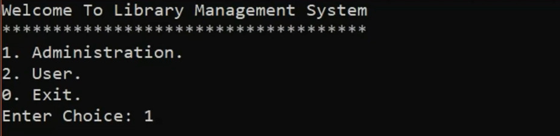
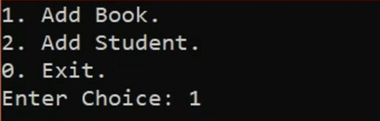
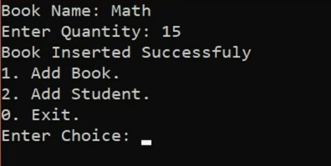

# 📚 Library Management System (C++ & MySQL)

A robust, console-based management application that bridges the gap between **Object-Oriented Programming (OOP)** in C++ and **Relational Database Management Systems (RDBMS)** using MySQL. This system automates library workflows, including inventory management and book issuance, with real-time data persistence.

---

## 🚀 Features

### 🛠 Administrative Module

* **Inventory Management:** Add new book records with specific quantities directly to the database.
* **Student Registration:** Enroll students into the system to allow them borrowing privileges.
* **Persistent Storage:** Unlike file-based systems, data remains saved in MySQL even after the application is closed.

### 👤 Student/User Module

* **Live Catalog:** View a real-time list of all available books and their current stock levels.
* **Book Issuance:** Students can "borrow" books by providing their unique Student ID.
* **Automated Validation:** The system automatically checks for Student ID validity and stock availability before processing a transaction.
* **Auto-Inventory Update:** Once a book is issued, the database quantity is automatically decremented.

---

## 🛠 Tech Stack

* **Language:** C++ (using OOP principles like Encapsulation and Abstraction).
* **Database:** MySQL 8.0+.
* **Connector:** MySQL Connector/C (libmysql) to bridge C++ and SQL.
* **Environment:** Dev-C++ / VS Code (Windows environment).

---

## 📊 Database Schema

The project utilizes a relational database named `LibraryDB` with two primary tables:

1. **`lib` Table:** Stores `name` (Primary Key) and `quantity`.
2. **`student` Table:** Stores unique `id` (Primary Key) for registration.

---

## ⚙️ How to Run the Project

### 1. Prerequisites

* Install **MySQL Server** and **MySQL Workbench**.
* Install a C++ Compiler (MinGW recommended).
* Download the **MySQL Connector/C** files (`include` and `lib` folders).

### 2. Database Setup

Execute the following SQL commands in your MySQL Command Line or Workbench:

```sql

CREATE DATABASE LibraryDB;
USE LibraryDB;

CREATE TABLE lib (name VARCHAR(100) PRIMARY KEY, quantity INT);
CREATE TABLE student (id VARCHAR(100) PRIMARY KEY);

```

### 3. Compiler Configuration (Linking)

To run the project, you must link the MySQL libraries in your IDE:

* **Include Directories:** Add the path to the MySQL `include` folder.
* **Library Directories:** Add the path to the MySQL `lib` folder.
* **Linker Settings:** Add `-lmysql` to your linker parameters.

### 4. Build and Run

1. Open the project in your IDE.
2. Update the `host`, `user`, and `password` variables in the code to match your MySQL credentials.
3. Compile and Run the `main.cpp` file.

---
## 📸 Screenshots

<p align="center">
  
  
  
</p>

## 🔮 Future Enhancements

* **Book Return Logic:** Implement a "Return Book" feature to increment quantity back into the database.
* **Due Dates & Fines:** Add a date-tracking system to calculate late fees for students.
* **Search Functionality:** Implement a search feature using `LIKE` SQL queries to find books by keywords.
* **GUI Transition:** Migrate from a console-based UI to a graphical interface using **Qt** or **WxWidgets**.

---
